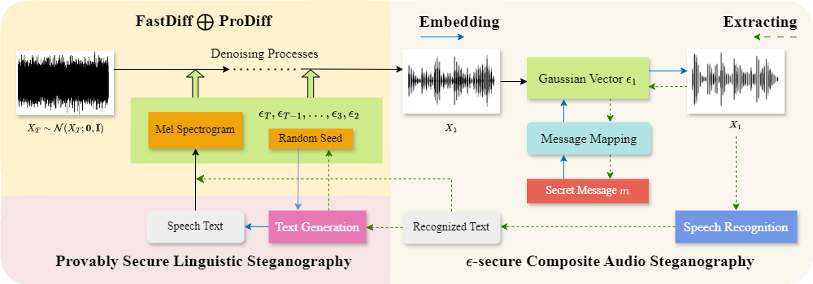

# CoAS: Composite Audio Steganography Based on Text and Speech Synthesis
This repository hosts the official PyTorch implementation of the paper: ["**CoAS: Composite Audio Steganography Based on Text and Speech Synthesis**"](https://ieeexplore.ieee.org/abstract/document/11036088) (Accepted by IEEE TIFS 2025).
## Method

We propose Composite Audio Steganography (CoAS), a method based on text and speech synthesis that leverages the multi-carrier characteristic of audio data by utilizing side-channel information from the transcript to facilitate the steganographic process. We first maps the secret message to Gaussian noise in a distribution-preserving manner and embeds it into the generation process of a diffusion model audio sequence. To address the reduced audio diversity caused by using a fixed random seed as a key, we embed the key into the audio text, which is then retrieved by the receiver via speech recognition. This approach allows the system to randomly select a key for each transmission, ensuring both accurate message extraction and the diversity of the generated audio for enhanced concealment.
## Getting Started
We will gradually split and implement the modules used in the CoAS system.
### Provably Secure Linguistic Steganography
In the CoAS system, you can choose any provably secure linguistic steganography. We will not go into details here, recommending one of them, [Discop](https://github.com/comydream/Discop).
### Audio Steganography
The audio steganography module in CoAS is based on [FastDiff](https://github.com/Rongjiehuang/FastDiff) and [ProDiff](https://github.com/Rongjiehuang/ProDiff), and implemented in the text-to-speech (TTS) task.
```
conda env create -f environment.yml 
conda activate coas
```
We directly use the pre-trained audio generation models provided by [Rongjie Huang](https://rongjiehuang.github.io/). You can also train your own model according to the instructions in [FastDiff](https://github.com/Rongjiehuang/FastDiff) and [ProDiff](https://github.com/Rongjiehuang/ProDiff) and put your checkpoints in `checkpoints/$method_name$/model_ckpt_steps_*.ckpt`
### Speech Recognition
### Metrics
## Acknowledgements
We heavily borrow the code from [FastDiff](https://github.com/Rongjiehuang/FastDiff), [ProDiff](https://github.com/Rongjiehuang/ProDiff) and [Discop](https://github.com/comydream/Discop). We appreciate the authors for sharing their code.
## Ciation
If you find our work useful for your research, please consider citing the following paper:
```
@ARTICLE{11036088,
  author={Li, Yiming and Chen, Kejiang and Wang, Yaofei and Zhang, Xin and Wang, Guanjie and Zhang, Weiming and Yu, Nenghai},
  journal={IEEE Transactions on Information Forensics and Security}, 
  title={CoAS: Composite Audio Steganography Based on Text and Speech Synthesis}, 
  year={2025},
  volume={20},
  number={},
  pages={5978-5991},
  keywords={Steganography;Diffusion models;Security;Speech synthesis;Receivers;Noise reduction;Gaussian noise;Entropy;Reviews;Linguistics;Steganography;provably secure;text;audio;diffusion model},
  doi={10.1109/TIFS.2025.3579581}}

```
